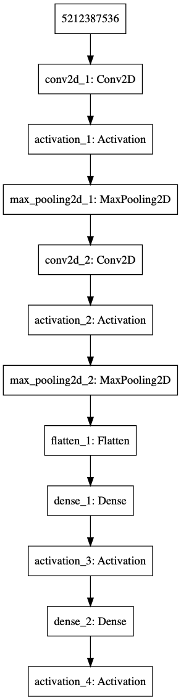

神经网络在停车厂的应用小Demo，训练时间很短，练手学习用。  

训练：train_network.py  
分类检测：classify.py  

  

网络模型  

 
 
训练  

参考：
https://www.pyimagesearch.com/2016/08/01/lenet-convolutional-neural-network-in-python/

公众号：  

  

